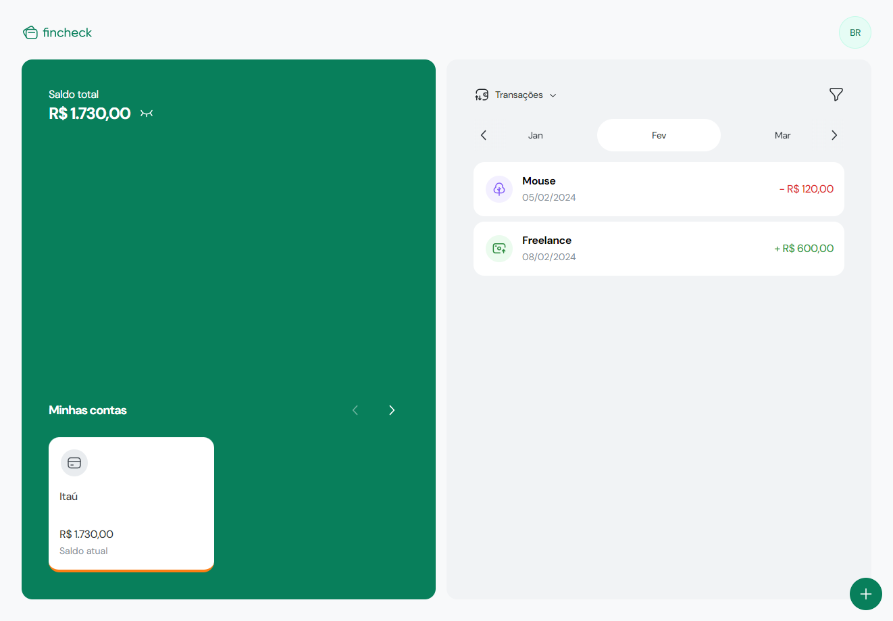
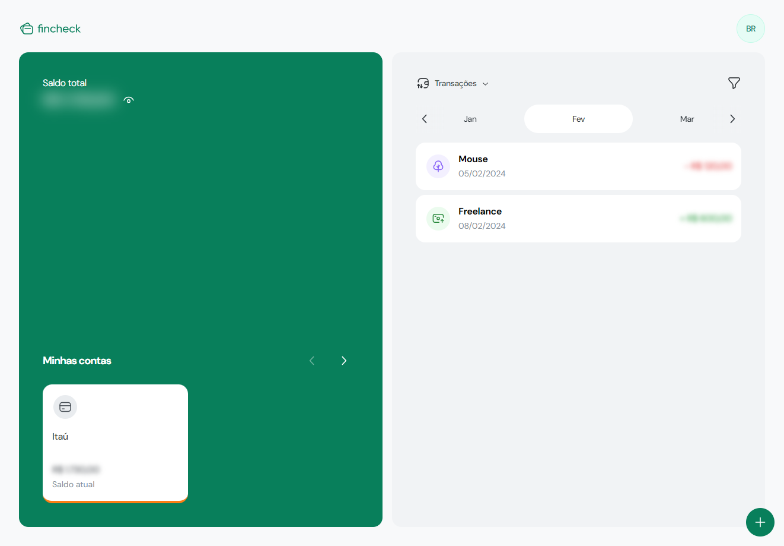

# Fincheck

[Live Site](https://brunooborges.github.io/my-fincheck-frontend/)

This project is a CRUD application created during the JStack course. It leverages Node.js with NestJS for the back end, providing a REST API, and utilizes React.js for the front end. The main purpose of the application is to manage your personal finances in a simples way by creating accounts, transactions (income or expense), and categories of transactions, all of which are supported through the implemented REST API.

At present, the back-end is hosted on Render, the database on ElephantSQL, and the front end on Github pages.

The base project didn't have any means CRUD functionality for the categories and for the user there were only the create method, so I decided to add this functionalities as well as an option to create transactions with installments.

I'll try to add more features whenever I can think of something new.

Technologies:

- Node.js with NestJS
- PostgreSQL
- Prisma
- React.js
- TailwindCSS

## Screenshots





# React + TypeScript + Vite

This template provides a minimal setup to get React working in Vite with HMR and some ESLint rules.

Currently, two official plugins are available:

- [@vitejs/plugin-react](https://github.com/vitejs/vite-plugin-react/blob/main/packages/plugin-react/README.md) uses [Babel](https://babeljs.io/) for Fast Refresh
- [@vitejs/plugin-react-swc](https://github.com/vitejs/vite-plugin-react-swc) uses [SWC](https://swc.rs/) for Fast Refresh

## Expanding the ESLint configuration

If you are developing a production application, we recommend updating the configuration to enable type aware lint rules:

- Configure the top-level `parserOptions` property like this:

```js
export default {
  // other rules...
  parserOptions: {
    ecmaVersion: 'latest',
    sourceType: 'module',
    project: ['./tsconfig.json', './tsconfig.node.json'],
    tsconfigRootDir: __dirname,
  },
};
```

- Replace `plugin:@typescript-eslint/recommended` to `plugin:@typescript-eslint/recommended-type-checked` or `plugin:@typescript-eslint/strict-type-checked`
- Optionally add `plugin:@typescript-eslint/stylistic-type-checked`
- Install [eslint-plugin-react](https://github.com/jsx-eslint/eslint-plugin-react) and add `plugin:react/recommended` & `plugin:react/jsx-runtime` to the `extends` list

## Available Scripts

In the project directory, you can run:

### `yarn dev`

Runs the app in the development mode.\
Open [http://localhost:5173](http://localhost:5173) to view it in your browser.

The page will reload when you make changes.\
You may also see any lint errors in the console.

### `yarn build`

Builds the app for production to the `build` folder.\
It correctly bundles React in production mode and optimizes the build for the best performance.

The build is minified and the filenames include the hashes.\
Your app is ready to be deployed!
